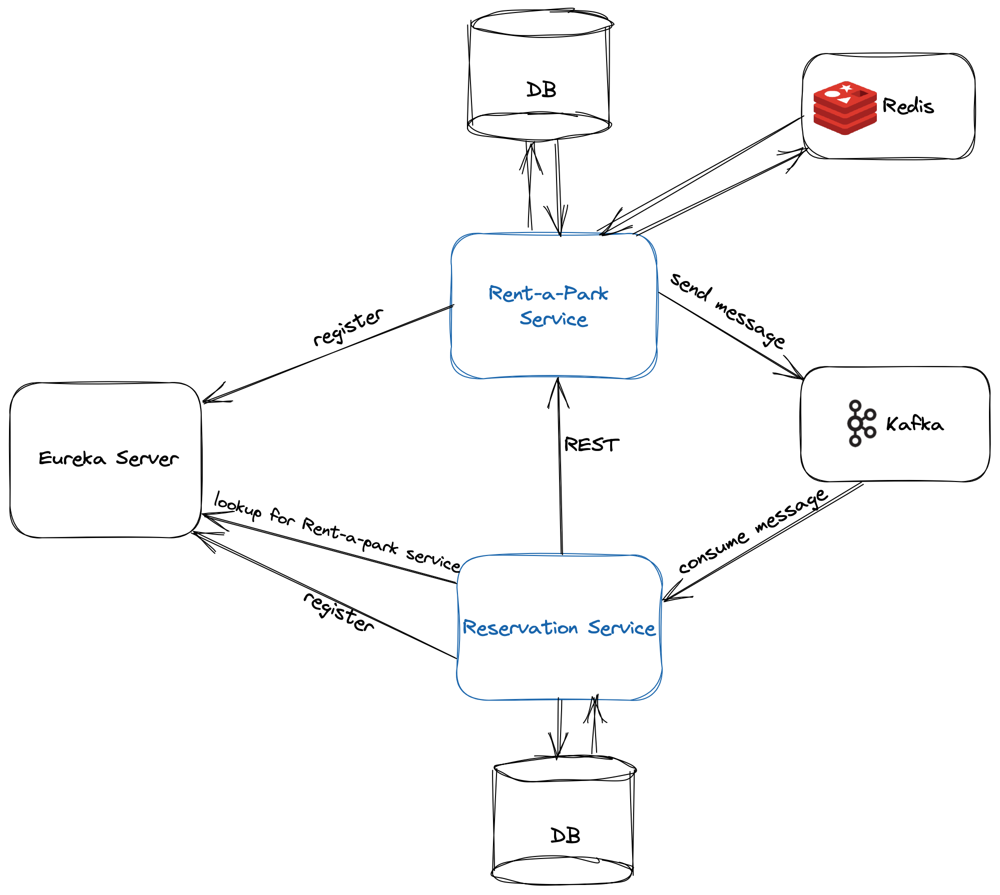

# Reservation-Service

### Technologies:

## Content

### Technologies

* Java
* Spring Boot, Spring Cloud
* PostgreSQL
* Docker
* Kafka

### Features
* Create, update, delete and list reservations
* Find parking spots from [Parking Service](https://github.com/Code-Of-Us/Rent-A-Park)
* Used Test Containers in integration tests for setting up Postgres and Eureka containers

### CI/CD

* GitHub actions for Continuous Integration (CI)
    * Build with CodeCov
    * Code Analysis with SonarCloud
    * Build and push Docker image to GitHub Container Registry
    * Public GitHub package
    * Docker file
    * Docker compose file for setting up external services like Postgres and Eureka

### Microservice architecture
* Eureka server - Service Registry and Client-side service discovery using Eureka
* Feign Client
* Circuit Breaker and Retry mechanism

